# 🐶 PetSync App – Pet Management Made Easy 🐾

**PetSync** is an all-in-one Android app for pet management, developed using Kotlin, Firebase Firestore, and OpenStreetMap. It enables pet lovers to explore adoptable pets, book appointments, shop for pet essentials, and connect with nearby pet organizations. Pet organizations can list pets, handle appointment requests, and communicate with users directly via SMS and WhatsApp.

---

## 📲 Key Features

### 👥 For Users:
- 🔍 Browse available pets listed by registered organizations.
- 📅 Book appointments to adopt or purchase pets.
- 🛒 Explore pet-related groceries and add to cart.
- 👤 Manage personal profile and preferences.
- 🗺️ View nearby pet organizations using OpenStreetMap.
- 🔔 Get in-app reminders and notifications for bookings and updates.
- ❌ Pets approved for adoption are hidden from other users to avoid duplication.

### 🏢 For Pet Organizations:
- ➕ Add and manage pet listings with full details.
- 📥 Receive and review adoption/booking requests.
- ✅ Approve or ❌ Reject requests.
- 📤 Approved requests trigger:
  - SMS confirmation (via Android intent)
  - WhatsApp message (via WhatsApp URL scheme)
- 🧾 View and update the status of pets and requests.
- 👤 Manage organization profile details.

---

## 🔧 Tech Stack

- 📱 **Language**: Kotlin  
- 🔥 **Database**: Firebase Firestore (only Firestore used)  
- 🗺️ **Maps**: OpenStreetMap (via osmdroid library)  
- 🔔 **Notifications**: Local Android notifications  
- ✉️ **Communication**: Intent-based SMS & WhatsApp 

---

## 📸 Screenshots

Here are some visuals of the PetSync app:

### 🏠 App Entry Screens
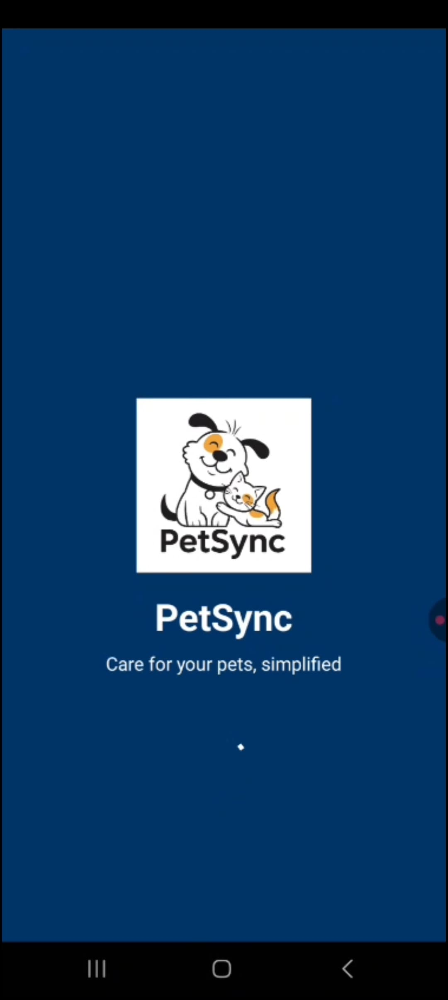
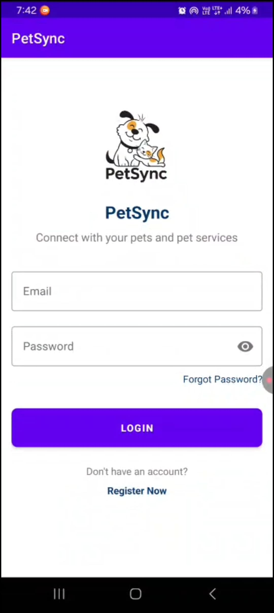
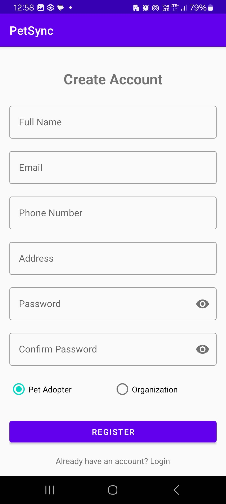
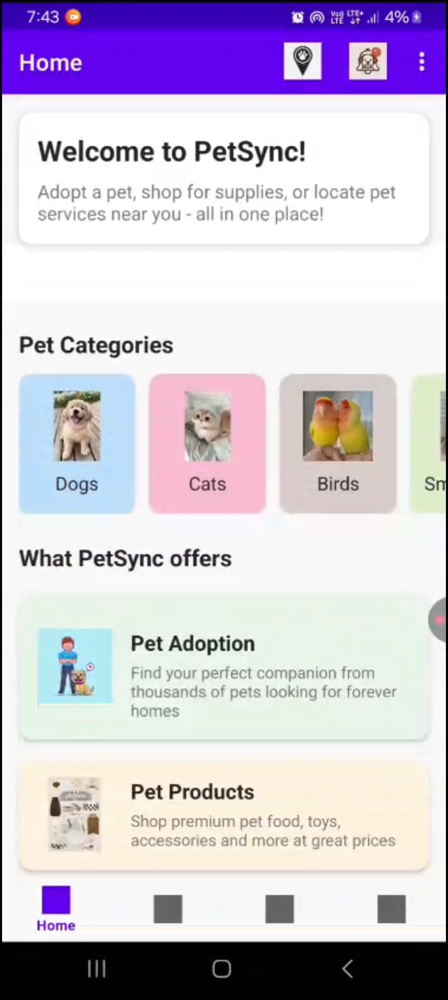

---

### 👤 User Features
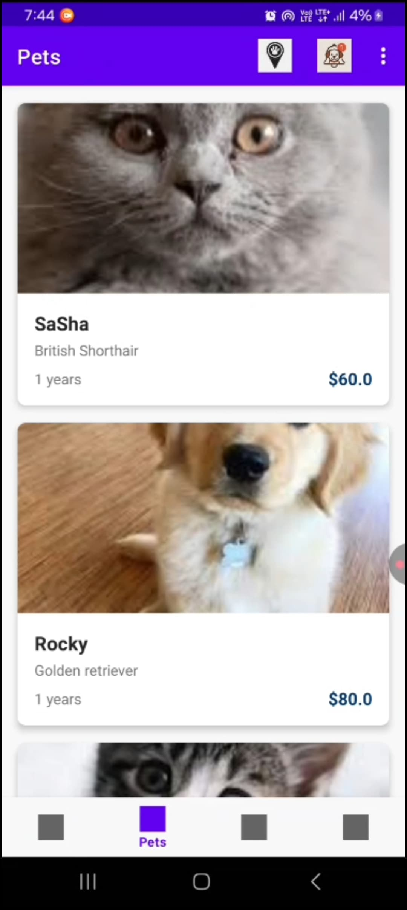
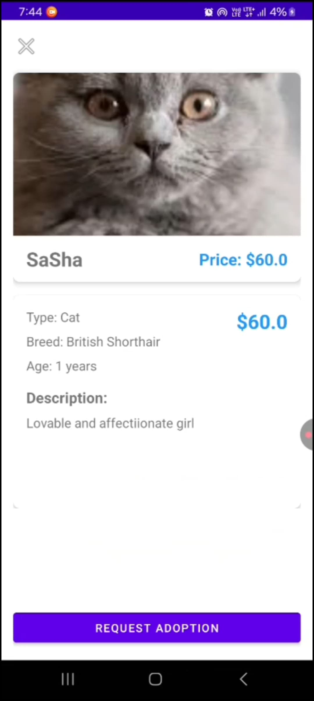
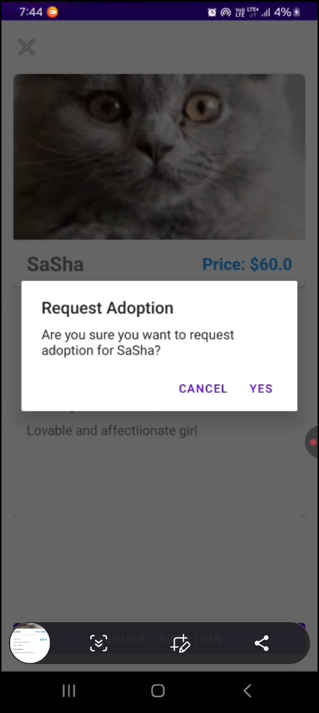

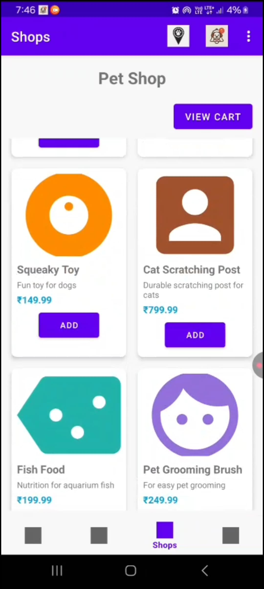
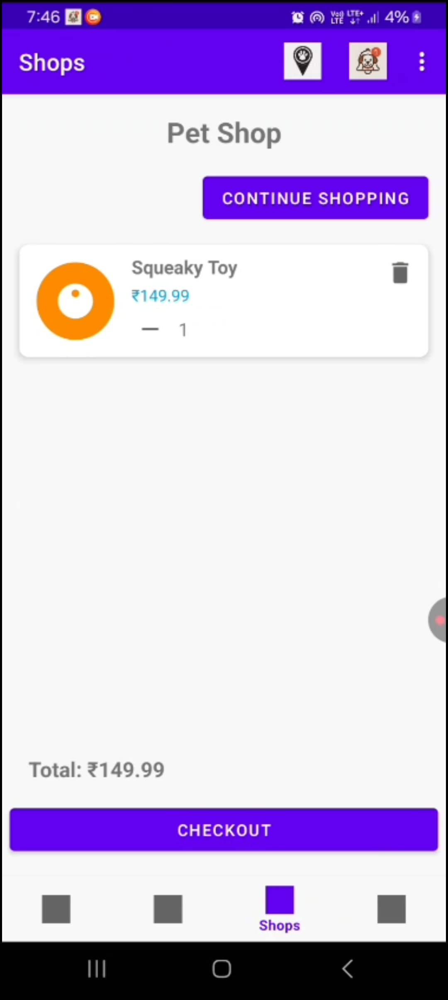
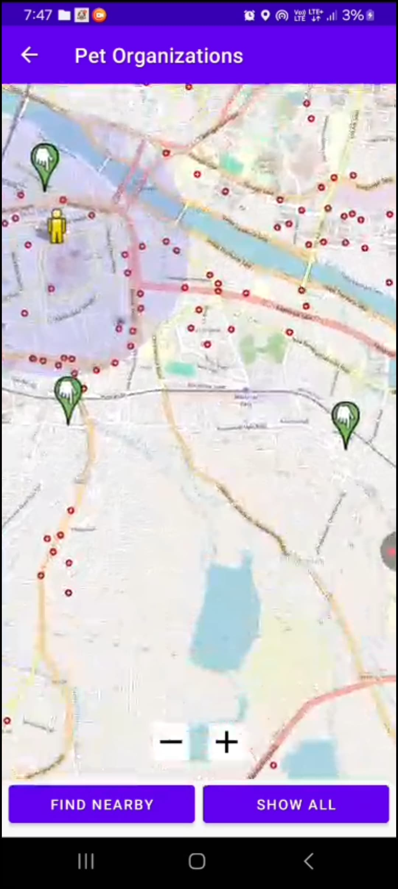
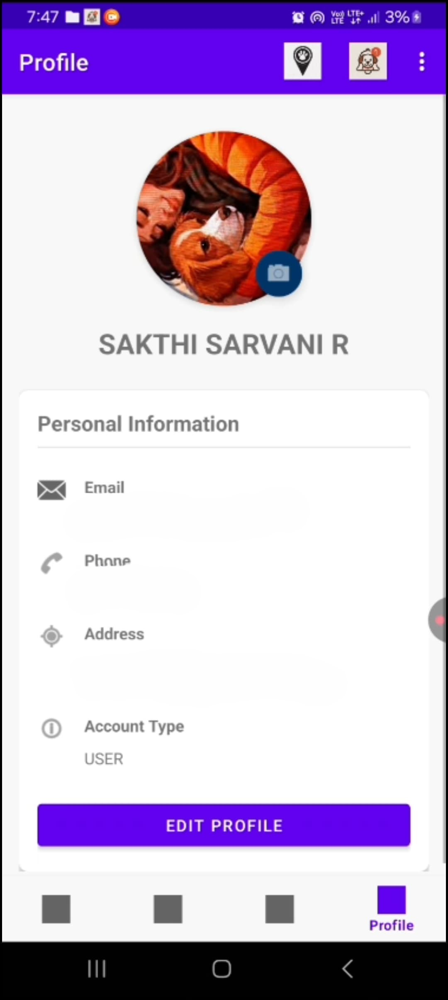

---

### 🏢 Organization Features
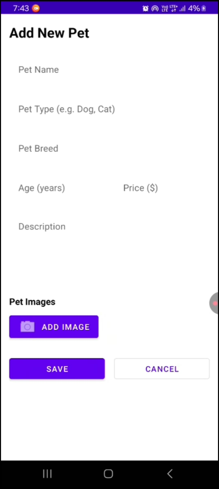
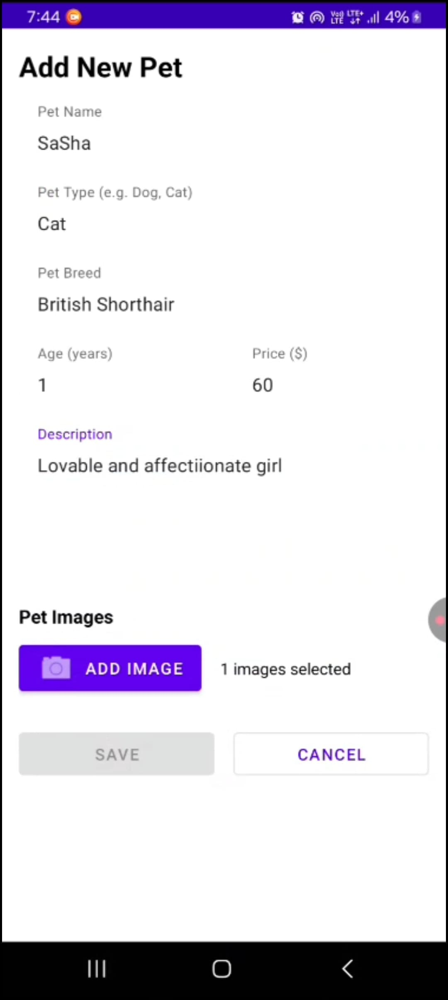
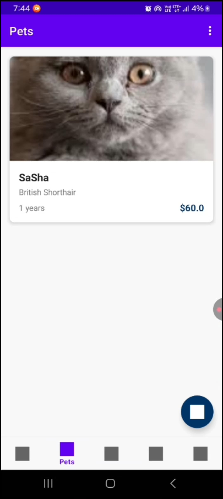
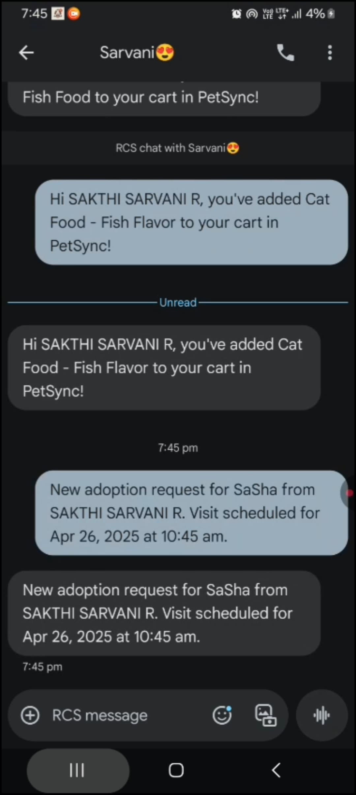

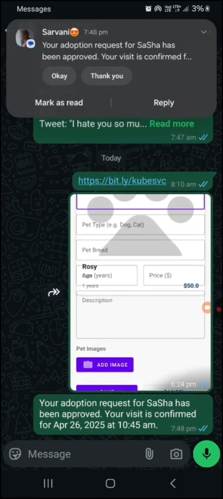
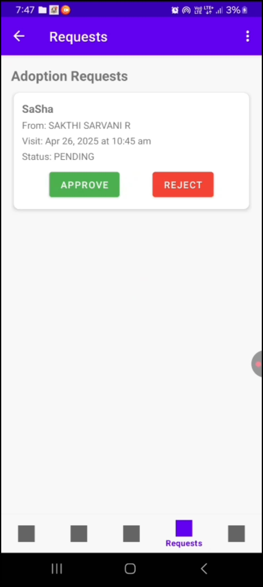
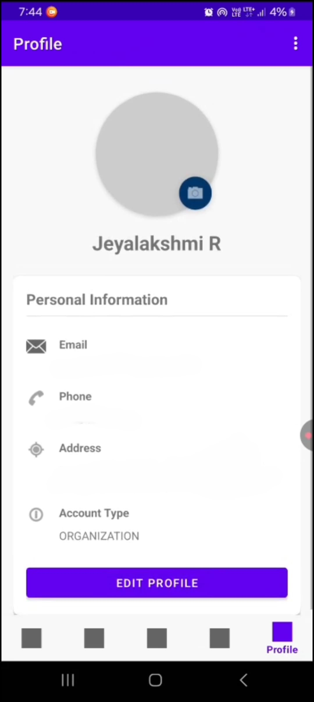

---

## 📥 How to Clone & Run the Project

Follow these steps to set up and run the project in Android Studio:

1. Open **Android Studio**.
2. Go to: `File` → `New` → `Project from Version Control`.
3. Paste the repository URL below:
   ```
   https://github.com/Sarvani-5/PetSync.git
   ```
4. Click **Clone** and wait for the project to sync.

---

### ⚠️ Firebase Setup Required

To enable Firestore and notifications:

- Replace the existing `google-services.json` file with your own, from your Firebase project.
- Enable **Firestore** in the Firebase console.
- Make sure your Firestore rules match your usage (read/write for users and orgs).

---

## ✅ Highlights Recap

- 💾 Firestore integration for real-time pet and user data.
- 📤 WhatsApp and SMS alerts for approved appointments (via device intent).
- 🗺️ Map-based discovery of nearby organizations using OpenStreetMap.
- 🛍️ Pet grocery browsing and checkout flow.
- 🔒 Pets marked as “Approved” are hidden from other users.
- ✨ Clean, intuitive UI for both users and organizations.

---

Made with ❤️ for all animal lovers and pet care advocates.  
